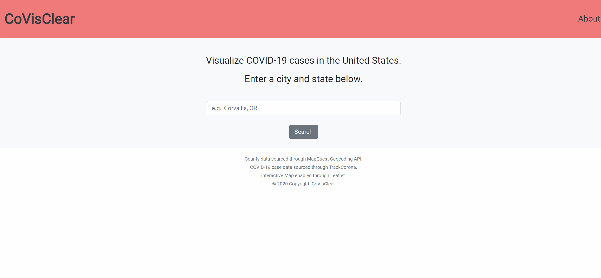

# CoVisClear

CoVisClear is a web application that allows users to look up COVID-19 case data based on location.


## Live Version

A live version of this application can be found [here](https://covisclear.herokuapp.com).

## Local Installation & Usage

Use the package manager [npm](https://www.npmjs.com/) to install the necessary packages and dependencies.

```bash
npm install
```

Create a .env file in the same directory as app.js. Use .sample-env as a reference. Be sure to 
assign a valid value to all environment variables in the .env file. You will need to sign up for a
[MapQuest](https://developer.mapquest.com/) API key and [MapBox](https://www.mapbox.com/) API key first.
```
MAPQUEST_API_KEY=[value]
MAPBOX_API_KEY=[value]
```

To run the application, use [Node.js](https://nodejs.org/en/).

```bash
npm start
```

## Usage Example



## Authors

* [Anjanette Oborn](https://github.com/oborna)
* [Timothy Yoon](https://github.com/timsyoon)
* [Rohit Chaudary](https://github.com/rorochaudhary)
* [Patricia Booth](https://github.com/alpacawool)

## License
[gpl-3.0](https://choosealicense.com/licenses/gpl-3.0/)